# Proyecto Final — Arquitecto Cloud
**Sistemas Operativos 750001C | Semestre 1 – 2026**
**Universidad del Valle**

---

## Equipo

| Nombre | Código | Rol |
|--------|--------|-----|
| Juan David Nuñez Benitez | 202560692 | Virtualización + Documentacion |
| Edgar Steven Urrea Espinosa | 202560922 | Docker + Sitio Web |
| Franklin Esteban Orjuela Piñeros | 202560685 | Kubernetes + Video de Youtube |
| Santiago Olave Mena | 20XXXXXX | Documentación |

**Grupo asignado:** Grupo 7
**Distribución gráfica:** [Zorin OS 17] 
**Distribución consola:** [Ubuntu 24.04 Server]  
**Imagen Docker base:** [debian:13]

---

## Componente 1: Virtualización con Linux

**Distribuciones instaladas:** VM Gráfica + VM Consola  
**Herramienta:** VirtualBox / VMware

### Evidencias
- Captura instalación VM gráfica


- Captura instalación VM consola
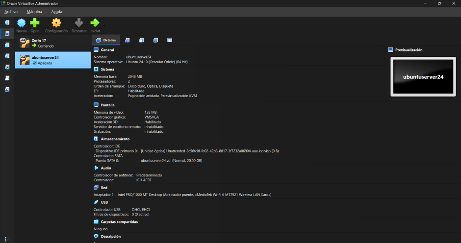

- Captura particionamiento (lsblk) VM gráfica
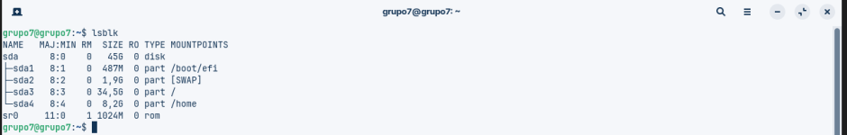

- Captura particionamiento (lsblk) VM consola
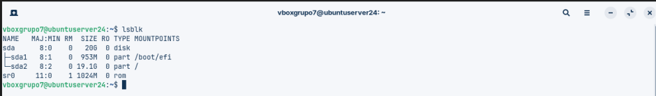
Nota: Esta maquina no nos dejaba crear las particiones manuales, al terminar de instalarse solo abria
la terminal para ingresar el usuario y contraseña

- Captura informacion VM gráfica
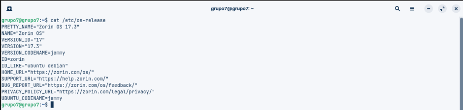

- Captura informacion VM consola
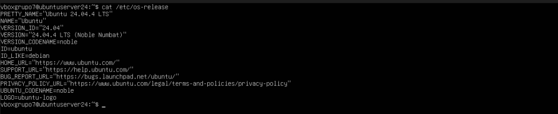

- Captura configuración de red VM's
- ip a (VM grafica)
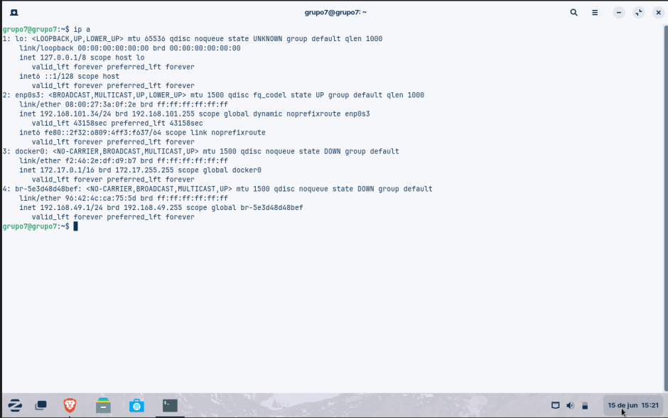

- ping id_VMC
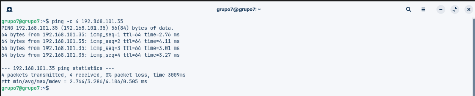

- ip a (VM consola)
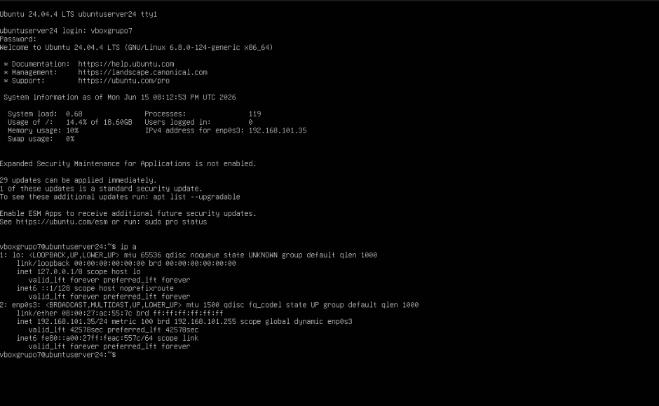

- ping id_VMG
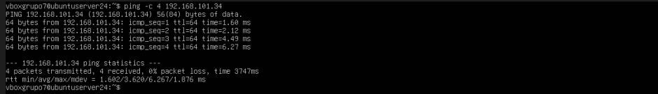

- Captura prueba SSH funcional
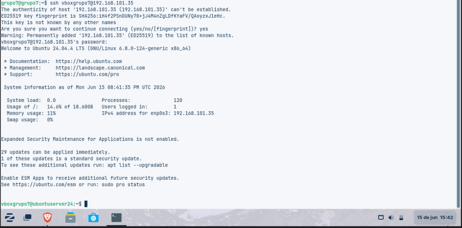

### Comandos principales
```bash
ip a                          # Ver interfaces de red
lsblk                         # Ver particiones
ssh usuario@ip_vm_consola     # Conectar por SSH
```

---

## Componente 2: Contenedores Docker

**Servicios implementados:**
- Frontend: Nginx sirviendo HTML estático (puerto 80)
- Backend: Python HTTP (puerto 5000)

### Estructura de archivos
```
docker/
├── frontend/
│   ├── Dockerfile.frontend
│   └── index.html
├── backend/
│   ├── Dockerfile.backend
│   └── server.py
└── docker-compose.yml
```

### Evidencias
- Captura `docker compose up -d`
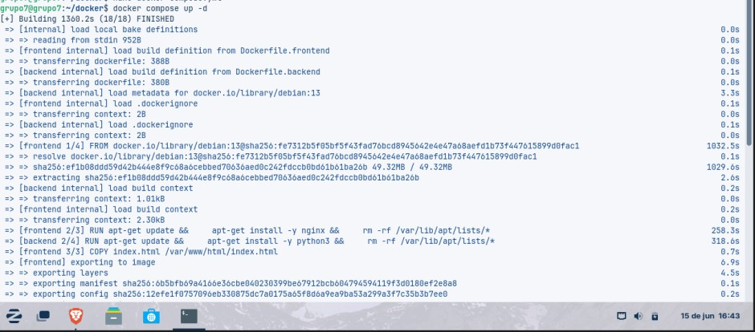
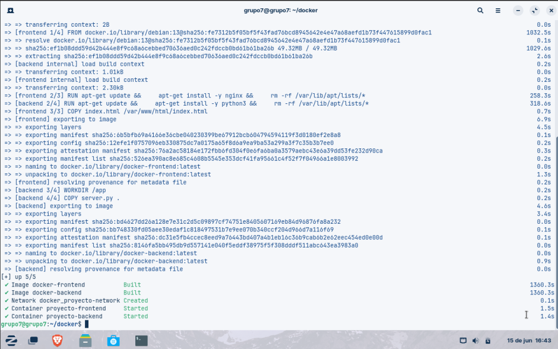

- Captura `docker ps` y `docker images`
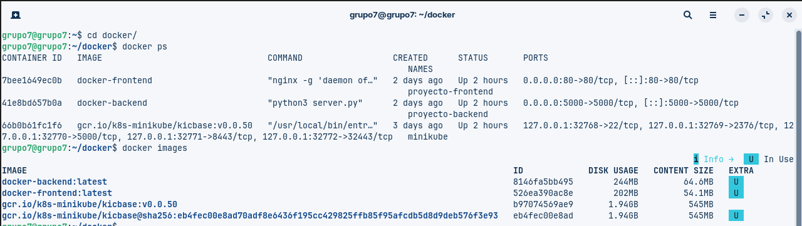

- Captura navegador accediendo al frontend
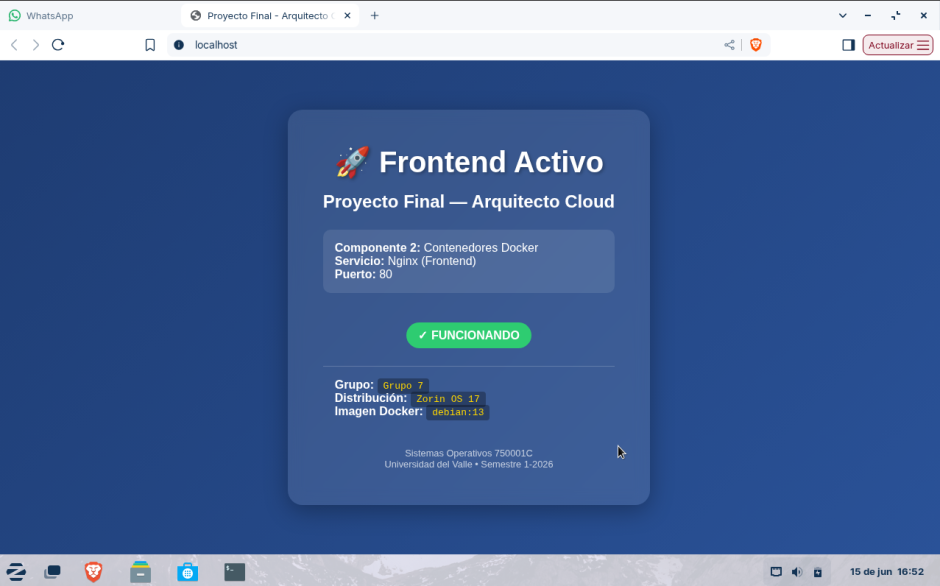

- Captura `curl http://localhost:5000`
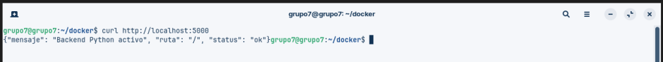
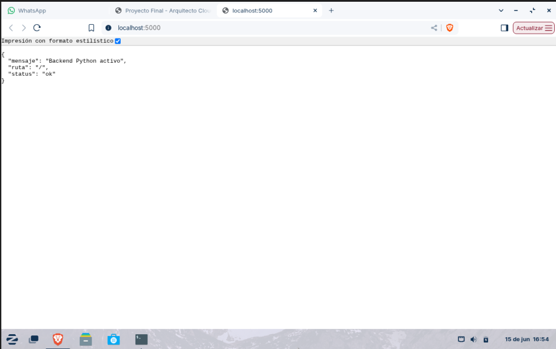

### Comandos principales
```bash
docker compose up -d
docker ps
docker images
curl http://localhost
curl http://localhost:5000
```

---

## Componente 3: Orquestación con Kubernetes

**Herramienta:** Minikube

### Manifiestos
- `deployment.yaml` — Nginx con 2 réplicas
- [deployment.yaml](laboratorio_k8s/deployment.yaml) — Nginx con 3 réplicas.
Nota: Con 3 replicas debido a que se hizo el escalado a 3 antes de subir el archivo al repositorio

- `service.yaml` — NodePort en puerto 30080
- [service.yaml](laboratorio_k8s/service.yaml) — NodePort en puerto 30080

### Evidencias
- Captura `minikube start`
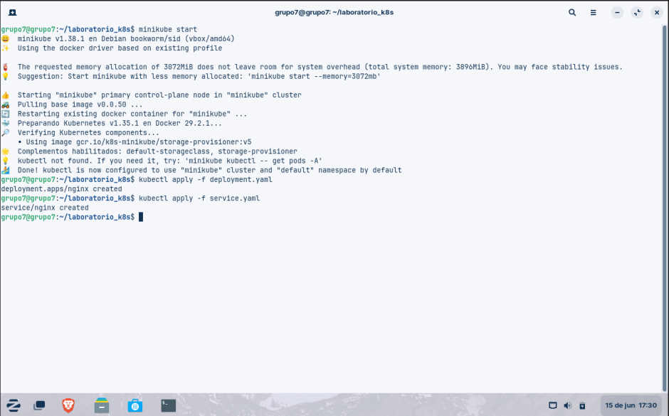

- Captura `kubectl get pods`
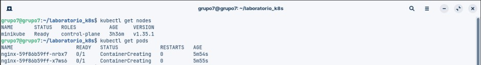

- Captura `kubectl get svc`
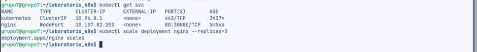

- Captura acceso desde navegador
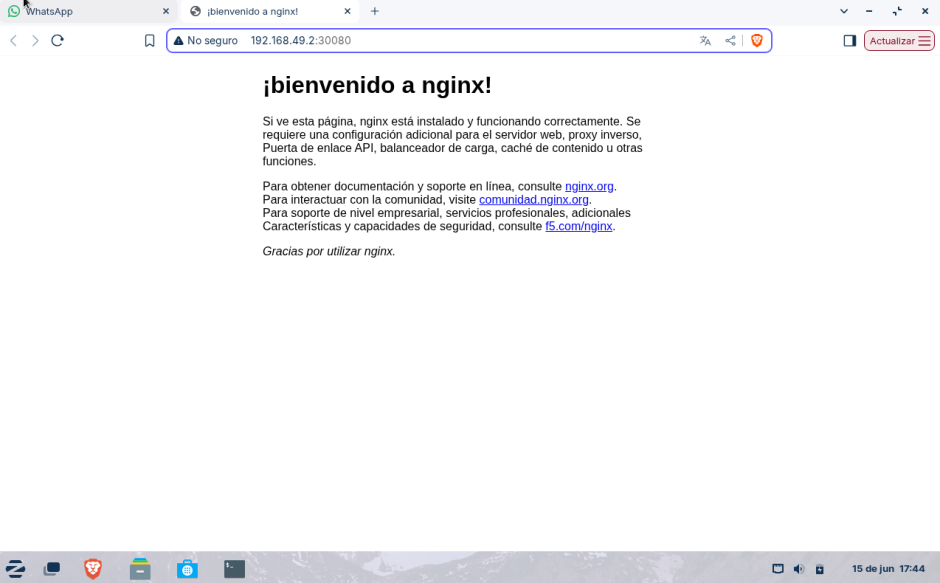

- Captura escalado a 3 réplicas
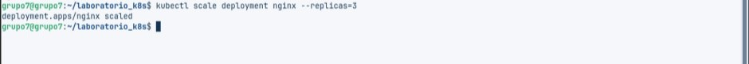
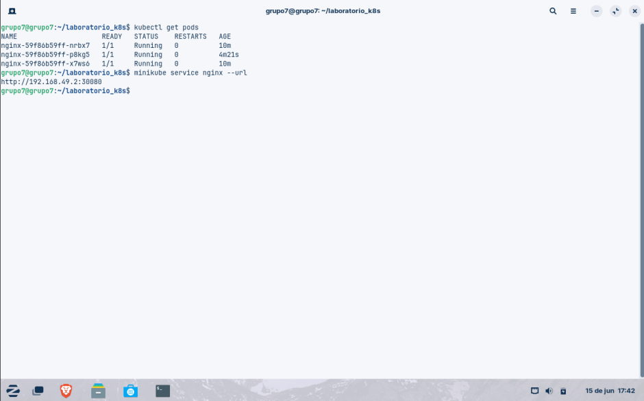

### Comandos principales
```bash
minikube start
kubectl apply -f deployment.yaml
kubectl apply -f service.yaml
kubectl get pods
kubectl scale deployment nginx --replicas=3
minikube service nginx --url
```

---

## Componente 4: Sitio Web de Documentación

**URL del sitio:** [https://...]  
**Video YouTube:** [https://youtu.be/...]

### Secciones del sitio
- Home: introducción y objetivos
- Equipo: integrantes con fotos y roles
- Componentes: descripción, capturas y comandos de cada uno
- Conclusiones: aprendizajes, dificultades y recomendaciones

---

## Diagrama de Arquitectura

> Insertar imagen del diagrama (draw.io / Miro / Lucidchart)

---

## Conclusiones

1. [Aprendizaje principal]
**Pasar todo a contenedores nos salvó la vida:** El aprendizaje principal fue ver cómo cambia la cosa al separar el Frontend y el Backend en contenedores de Docker en lugar de meter todo en un solo bloque. Al montarlos sobre Debian 13 nos dimos cuenta de que cada servicio trabaja por su lado sin interferir con el otro, lo que hace que todo sea mucho más ordenado y fácil de manejar.


2. [Dificultad encontrada y cómo se resolvió]
**Los errores de red y de paquetes nos hicieron sufrir, pero se solucionaron:** La mayor dificultad fue cuando la máquina virtual se bloqueó y no quería instalar Git por culpa de unos paquetes rotos, y también cuando los Pods de Nginx en Minikube no querían conectar. Al final lo arreglamos metiendo el paquete a la fuerza con comandos manuales y amarrando bien los servicios al puerto 30080 con NodePort para que el tráfico saliera sin problemas.


3. [Recomendación para futuros proyectos]
**Para la próxima, se necesita una mejor computadora:** Como recomendación para los que vayan a hacer este proyecto después, seria bueno tener una buena máquina con bastante memoria RAM. Correr VirtualBox, la máquina virtual, Docker y encima prender Minikube al mismo tiempo pone la computadora lentísima si no se le asignan buenos recursos desde el principio.
---

*Proyecto desarrollado para la asignatura Sistemas Operativos 750001C — Semestre 1, 2026*
