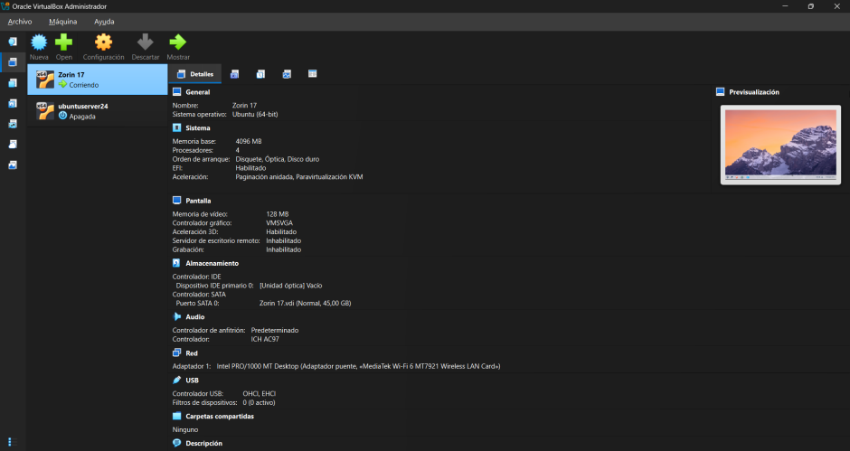

# Proyecto Final — Arquitecto Cloud
**Sistemas Operativos 750001C | Semestre 1 – 2026**
**Universidad del Valle**

---

## Equipo

| Nombre | Código | Rol |
|--------|--------|-----|
| Juan David Nuñez Benitez | 202560692 | Virtualización + Documentacion |
| Edgar Steven Urrea Espinosa | 202560922 | Docker + Sitio Web |
| Franklin Esteban Orjuela Piñeros | 202560685 | Kubernetes + Video de Youtube |
| Santiago Olave Mena | 20XXXXXX | Documentación |

**Grupo asignado:** Grupo 7
**Distribución gráfica:** [Zorin OS 17] 
**Distribución consola:** [Ubuntu 24.04 Server]  
**Imagen Docker base:** [debian:13]

---

## Componente 1: Virtualización con Linux

**Distribuciones instaladas:** VM Gráfica + VM Consola  
**Herramienta:** VirtualBox / VMware

### Evidencias
- Captura instalación VM gráfica


- Captura instalación VM consola


- Captura particionamiento (lsblk) VM gráfica


- Captura particionamiento (lsblk) VM gráfica


- Captura informacion VM gráfica


- Captura informacion VM consola


- Captura configuración de red VM's
- ip a (VM grafica)


- ping id_VMC


- ip a (VM grafica)


- ping id_VMG


- Captura prueba SSH funcional


### Comandos principales
```bash
ip a                          # Ver interfaces de red
lsblk                         # Ver particiones
ssh usuario@ip_vm_consola     # Conectar por SSH
```

---

## Componente 2: Contenedores Docker

**Servicios implementados:**
- Frontend: Nginx sirviendo HTML estático (puerto 80)
- Backend: Python HTTP (puerto 5000)

### Estructura de archivos
```
docker/
├── frontend/
│   ├── Dockerfile.frontend
│   └── index.html
├── backend/
│   ├── Dockerfile.backend
│   └── server.py
└── docker-compose.yml
```

### Evidencias
- Captura `docker compose up -d`
- Captura navegador accediendo al frontend
- Captura `curl http://localhost:5000`

### Comandos principales
```bash
docker compose up -d
docker ps
docker images
curl http://localhost
curl http://localhost:5000
```

---

## Componente 3: Orquestación con Kubernetes

**Herramienta:** Minikube

### Manifiestos
- `deployment.yaml` — Nginx con 2 réplicas
- `service.yaml` — NodePort en puerto 30080

### Evidencias
- Captura `kubectl get pods`
- Captura `kubectl get svc`
- Captura acceso desde navegador
- Captura escalado a 3 réplicas

### Comandos principales
```bash
minikube start
kubectl apply -f deployment.yaml
kubectl apply -f service.yaml
kubectl get pods
kubectl scale deployment nginx --replicas=3
minikube service nginx --url
```

---

## Componente 4: Sitio Web de Documentación

**URL del sitio:** [https://...]  
**Video YouTube:** [https://youtu.be/...]

### Secciones del sitio
- Home: introducción y objetivos
- Equipo: integrantes con fotos y roles
- Componentes: descripción, capturas y comandos de cada uno
- Conclusiones: aprendizajes, dificultades y recomendaciones

---

## Diagrama de Arquitectura

> Insertar imagen del diagrama (draw.io / Miro / Lucidchart)

---

## Conclusiones

1. [Aprendizaje principal]
2. [Dificultad encontrada y cómo se resolvió]
3. [Recomendación para futuros proyectos]

---

*Proyecto desarrollado para la asignatura Sistemas Operativos 750001C — Semestre 1, 2026*
